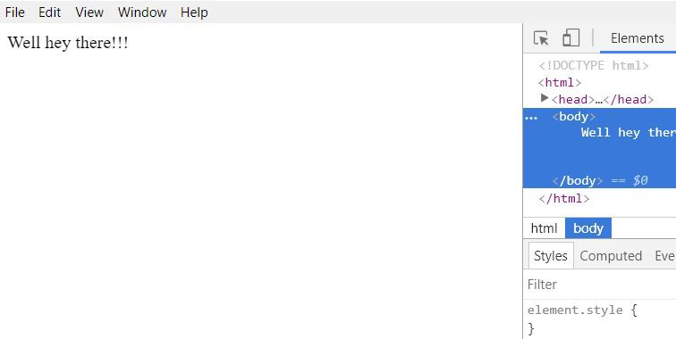
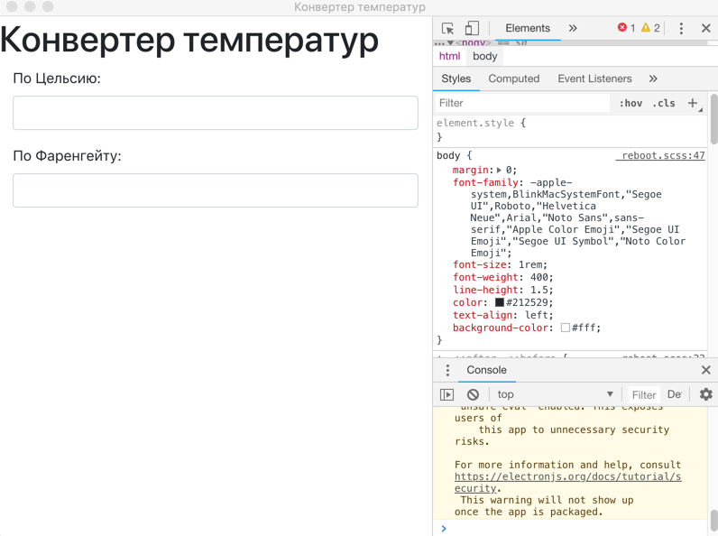

_Перевод «[How to Easily Build Desktop Apps with HTML, CSS and JS](https://medium.com/p/d3e3f03f95a5)» Адитьи Шридхары._

<figure>
    
    <figcaption>
        Фотография <a href="https://unsplash.com/@robinpierre">Робина Пьерра</a>
    </figcaption>
</figure>

Можно ли использовать HTML, CSS и JavaScript для создания десктопных приложений?

Ответ — да :)

В этой статье мы сосредоточимся в основном на том, как Electron можно использовать для создания десктопных приложений с использованием веб-технологий.

## Electron

[Electron](https://electronjs.org/) может быть использован для создания десктопных приложений, также эти приложения будут мультиплатформенными — Windows, Mac, Linux и другие.

Electron объединяет Chromium и Node.js в одну среду исполнения. Это позволяет нам запускать код HTML, CSS и JavaScript в виде десктопного приложения.

## Electron Forge

Если Electron используется напрямую, то перед сборкой приложения потребуется определённая ручная настройка. Также, если вы хотите использовать Angular, React, Vue или любой другой фреймворк или библиотеку, вам нужна будет ручная настройка.

[Electron Forge](https://electronforge.io/) значительно упрощает все вышеперечисленное.

Он предоставляет шаблонные приложения с Angular, React, Vue и другими фреймворками, что позволяет избежать дополнительных танцев с бубном.

Также он обеспечивает простоту сборки и упаковки приложения. В нём есть множество других функций, которые можно найти в [документации](https://docs.electronforge.io/).

## Предварительная подготовка

Убедитесь, что у вас установлен Node.js. Если нет, то его можно скачать [отсюда](https://nodejs.org/en/). Установите Electron Forge глобально, используя следующую команду:

```no-highlight
npm install -g electron-forge
```
## Начнём с приложения

Используйте следующую команду для создания вашего приложения:

```no-highlight
electron-forge init simple-desktop-app-electronjs
```

simple-desktop-app-electronicjs — это название приложения.

Потребуется некоторое время, чтобы команда, указанная выше, отработала. После завершения предыдущего процесса запустите приложение с помощью следующих команд:

```no-highlight
cd simple-desktop-app-electronjs
npm i
npm start
```
Это должно открыть окно как на скрине ниже:



## Разберёмся в структуре и коде

Приложение имеет определенную структуру папок. Здесь я перечислю некоторые важные моменты в этой структуре папок.

#### package.json

Содержит информацию о приложении, которое вы создаете, все зависимости, необходимые для приложения, и несколько скриптов. Некоторые из скриптов уже предварительно настроены, но вы также можете добавлять новые.

Путь `config.forge` содержит все конфигурации конкретно для Electron. Например, `make-target` используется для указания целевых файлов для различных платформ, таких как Windows, Mac или Linux.

#### src/index.js

Согласно `package.json`, `index.js` является основным скриптом. Процесс, который запускает основной скрипт, называется главным процессом. Таким образом, основной процесс запускает скрипт `index.js`.

Основной процесс нужен для отображения элементов интерфейса. Это делается путем создания страниц. Каждая созданная страница выполняется в процессе, называемом **процессом отрисовки**.

## Главный процесс и процесс отрисовки

Основное предназначение главного процесса — создание страниц с помощью экземпляра BrowserWindow. Экземпляр BrowserWindow использует процесс отрисовки для запуска каждой страницы.

**Любое приложение может иметь только один главный процесс, но много процессов визуализации.**

Также возможно взаимодействие между главным процессом и процессом отрисовки. Однако, я не буду останавливаться на этом в текущей статье.


_Архитектура Electron, показывающая главный процесс и процессы отрисовки. Названия файлов могут быть другими._

**abcd.html** показан в качестве второй веб-страницы в приведенной выше архитектуре. Но в нашем коде у нас не будет второй веб-страницы.

#### src/index.js

index.js загружает файл index.html в новый экземпляр `BrowserWindow`.

Это означает, что `index.js` создает новое окно GUI и загружает его со страницей `index.html`. Страница `index.html` запускается в своем собственном процессе отрисовки.

#### Код в index.js с пояснениями

Большая часть кода, созданного в `index.js`, содержит хорошие комментарии, объясняющие, что происходит. Здесь я упомяну несколько ключевых моментов, которые следует отметить в `index.js`:

```no-highlight
mainWindow = new BrowserWindow({
    width: 800,
    height: 600,
});

// и загрузи index.html из app.
mainWindow.loadURL(`file://${__dirname}/index.html`);
```

Приведенный выше фрагмент кода просто создает экземпляр `BrowserWindow` и загружает `index.html` в `BrowserWindow`. Вы увидите, что `app` часто используется в коде. Например, возьмите приведенный ниже фрагмент:

```no-highlight
app.on('ready', createWindow);
```

`app` используется для управления жизненным циклом событий приложения. Приведенный выше фрагмент кода говорит, что, когда приложение будет готово, нужно загрузить первое окно.

Точно так же `app` может использоваться для выполнения других действий с различными событиями. Например, его можно использовать для выполнения некоторых действий непосредственно перед закрытием приложения и так далее.

## Создадим десктопное приложение конвертера температур

Давайте воспользуемся тем же приложением, которое мы создали ранее, и немного изменим его, чтобы создать приложение конвертера температуры.

Сначала давайте установим Bootstrap с помощью следующей команды:

```no-highlight
npm install bootstrap --save
```

Скопируйте следующий код в src/index.html:

```no-highlight
<!DOCTYPE html>
<html>
  <head>
    <meta charset="utf-8">
    <title>Конвертер температур</title>
    <link rel="stylesheet" href="../node_modules/bootstrap/dist/css/bootstrap.min.css">
  </head>
  <body>
    <h1>Конвертер температур</h1>
    <div class="form-group col-md-3">
      <label for="celcius">По Цельсию:</label>
      <input type="text" class="form-control" id="celcius" onkeyup="celciusToFahrenheit()">
    </div>
    <div class="form-group col-md-3">
      <label for="fahrenheit">По Фаренгейту:</label>
      <input type="text" class="form-control" id="fahrenheit" onkeyup="fahrenheitToCelcius()">
    </div>
    <script src="renderer.js"></script>
  </body>
</html>
```

Приведенный выше код выполняет следующие действия:

1.  Создаёт поле ввода текста с `id="celcius"`. Всякий раз, когда в это поле что-то вводится, вызывается функция `celciusToFahrenheit()`.
2.  Создаёт поле ввода текста с `id="fahrenheit"`. Всякий раз, когда в это поле что-то вводится, вызывается функция `fahrenheitToCelcius()`.
3.  Когда в поле ввода «По Цельсию» вводится значение, в поле «По Фаренгейту» показывается та же температура, но в Фаренгейтах.
4.  Когда в поле ввода «По Фаренгейту» вводится значение, в поле «По Цельсию» показывается та же температура, но в Цельсиях.

2 функции, которые выполняют преобразование температуры, будут храниться в `renderer.js`.

Создайте файл с именем renderer.js внутри src. Скопируйте в него следующий код:

```no-highlight
function celciusToFahrenheit(){
    let celcius = document.getElementById('celcius').value;
    let fahrenheit = (celcius * 9 / 5) + 32;
    document.getElementById('fahrenheit').value = fahrenheit;

}

function fahrenheitToCelcius(){
    let fahrenheit = document.getElementById('fahrenheit').value;
    let celcius = (fahrenheit - 32) * 5 / 9;
    document.getElementById('celcius').value = celcius;
}
```

Функция `celciusToFahrenheit()` считывает значение в текстовом поле «По Цельсию», преобразует его в градусы Фаренгейта и записывает новую температуру в текстовое поле «По Фаренгейту».

Функция `fahrenheitToCelcius()` делает ровно наоборот.

## Запускаем приложение

Запустите приложение, используя следующую команду:

```no-highlight
npm start
```

Должно открыться следующее окно. Попробуйте ввести разные значения в инпуты.



Упаковываем приложение

## Упаковываем приложение

Команда для упаковки приложения:

```no-highlight
npm run package
```

Выполнение этой команды потребует некоторого времени. Как только выполнение закончится, проверьте папку `out` в папке проекта.

Я проверил это на машине c Windows. Была создана папка с именем `simple-desktop-app-Electronjs-win32-x64` внутри папки `out`.

Таким образом, в папке `out/simple-desktop-app-Electronjs-win32-x64` команда создала файл `.exe` для этого приложения. Нажатие на исполняемый файл автоматически запускает десктопное приложение.

_При создании приложения на macOS, папка внутри `out` называется `simple-desktop-app-Electronjs-darwin-x64` и создаётся файл `.app`, который работает точно так же, прим. переводчика._

Имя папки `simple-desktop-app-electronicjs-win32-x64` может быть разделено на `имя-платформа-архетиктура`, где

- имя — `simple-desktop-app-electronjs`
- платформа — `win32` (`darwin` на macOS)
- архетиктура — `x64`

Когда вы запускаете команду без каких-либо параметров, по умолчанию она упаковывает пакеты для платформы, на которой вы разрабатываете.

Допустим, мы хотим пакет для другой платформы и архитектуры. Тогда вы можете использовать следующий синтаксис:

```no-highlight
npm run package -- --platform=<платформа> arch=<архитектура>
```
Например, чтобы упаковать приложение для Linux, вы можете использовать следующую команду:

```no-highlight
npm run package -- --platform=linux --arch=x64
```
Это создаст папку с именем `simple-desktop-app-electronicjs-linux-x64` внутри папки `out`.

## Создание файла make

Чтобы создать файл `make` или установщик для приложения, используйте следующую команду:

```no-highlight
npm run make
```

Потребуется некоторое время на выполнение этой команды. Как только процесс закончится, проверьте папку `out` в папке проекта.

В папке out/make будет создан установщик Windows для десктопного приложения _(или ZIP-архив на macOS)_.

Когда вы запускаете эту команду без каких-либо параметров, по умолчанию она создает установщик для платформы, которую вы используете для разработки.

## Код

Код для этого приложения доступен в моем репозитории GitHub:
[**aditya-sridhar/simple-desktop-app-electronjs**
*A simple Temperature converter desktop app built using electron js - aditya-sridhar/simple-desktop-app-electronjs*github.com](https://github.com/aditya-sridhar/simple-desktop-app-electronjs)

*Форк репозитория на русском: [solarrust/simple-desktop-app-electronjs](https://github.com/solarrust/simple-desktop-app-electronjs).*

## Поздравляю 😄

Теперь вы знаете, как создавать десктопные приложения с использованием HTML, CSS и JavaScript. В этой статье были рассмотрены основные понятия об Electron и Electron-Forge. Почитайте [документацию](https://docs.electronforge.io/) чтобы узнать больше.

## Об авторе

Я люблю технологии и слежу за новинками. Мне также нравится помогать другим, делясь своими технологическими знаниями.

Не стесняйтесь связаться со мной через [LinkedIn](https://www.linkedin.com/in/aditya1811/), вы также можете подписаться на меня [в Твитере](https://twitter.com/adityasridhar18) или зайти [на мой сайт](https://adityasridhar.com/).

*Перевод [Алёны Батицкой](https://medium.com/@ABatickaya), редактура [Вадима Макеева](https://medium.com/@pepelsbey).*
